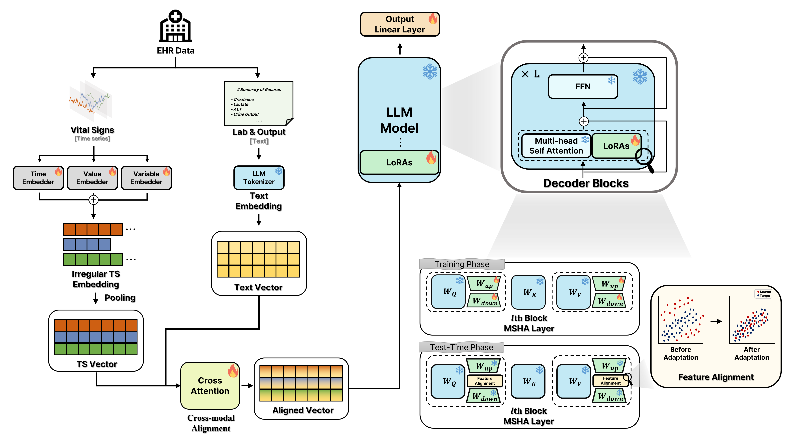

# Here is for EHR TTA via using LLM with PETM 

*My plan follows the architectures described below. Let's go!*

# Overall Architecture

# Embedding 순서 
1)  DataEmbedding_ITS_Ind_VarPrompt로 time series 데이터 serialization하게 만들어서 임베딩